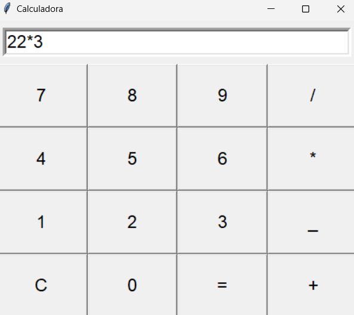
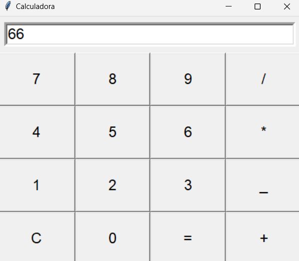

#interfaz grafica tkinter
En el presente directorio se utilizo el modulo tkinter para crear una interfaz grafica para la demostracion de un calculo por medio de la programacion de una calculadora

 Tkinter es una biblioteca en python la cual funciona para crear interfaces graficas la cual proporciona herramientas y widgets como botones,etiquetas y cuadros de texto y esto permite al usuario interarctuar con estas aplicaciones

_propietario_: Amanda Mena Murillo

Que hay que tener instalado para ejecutar el programa? y Que comando se deb utilizar ?

se debe de descargar la biblioteca Tkinter y debe de tener la aplicacion Visual studio code y descargar la libreria python.

## demostracion de la ejecucion del codigo
()

